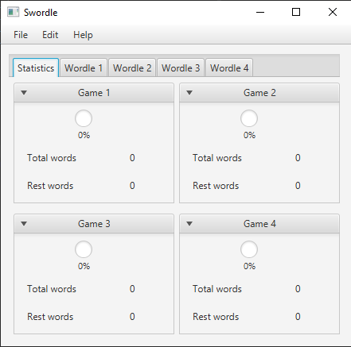
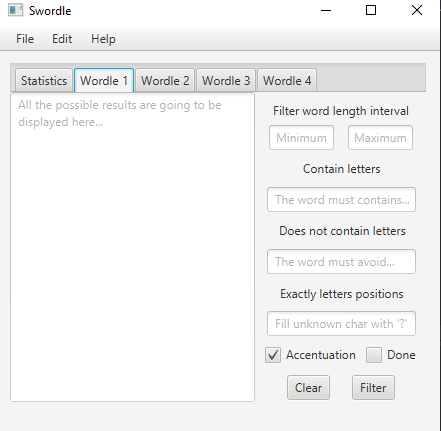

# SWordle

## Task list

- Issues
	1. [ ] Fix the scroll bar on textArea to be vertical.

- Refactory
	1. [ ] Use a shorter dictionary file for implementing JUnit5 tests to the Wordlist library project.
	1. [ ] Refactory this project some functions to the Wordlist library project.
	1. [ ] Refactory the Wordlist library project to others libraries projects.

## Description

SWordle (Solve Wordle with a swordle tool) is a implementation of [Word list filter library](https://github.com/henrikbeck95/wordlist) for solving any random word guess games such as Crossword and Wordle styles using regular expression on backend to short the amount of words possibilities.

### Screenshots

|Statistics					|Tab
:-------------------------:	|:-------------------------:
.|.

### Features

- Characters filters
	1. [x] Set world length minimum.
	1. [x] Set world length maximum.
	1. [x] Disable accentuation.
	1. [x] Enable accentuation.
	1. [x] Define the exactly character position.

- Modes
	1. [x] Source code.
	1. [x] Graphical user interface (GUI) (in progress).
	1. [ ] Command line interface (CLI).

- Supported languages
	1. [ ] English.
	1. [ ] French.
	1. [x] Portuguese.
	1. [ ] Spanish.

- Others
	1. [x] Supports up to 4 parallels verifications.
	1. [ ] Export the results to a plain text file.

- Warning
	> This project does not warranty to find the exactly word. Besides of that it implements a search filter for reducing the number of possibilities. All the thinking strategy it is still up to you. Be wise by choosing the best strategies.

## Games

- English version
	1. [Wordle game](https://www.nytimes.com/games/wordle/index.html).
	1. [WordlePlay game](https://wordleplay.com/).

- Portuguese version
	1. [Termoo game](https://term.ooo/).
	1. [Termoo game - Dueto](https://term.ooo/2/).
	1. [Termoo game - Quarteto](https://term.ooo/4/).
	1. [Wordle game - Portuguese](https://wordlegame.org/pt).
	1. [WordlePlay game](https://wordleplay.com/pt/).

## Instructions

### Playing the game

By using the following words, it is possible to reduce the amount of available possibilities.

- Suggest words table for trying first.

|Try	|English	|French	|Portuguese	|Spanish
|---	|---		|---	|---		|---
|1		|AUDIO		|?????	|AUREO		|?????
|2		|RESTY		|?????	|CLIPS		|?????
|3		|GLYPH		|?????	|DENTE		|?????
|4		|SALET		|?????	|VAGEM		|?????
|5		|WINKS		|?????	|MANGA		|?????
|6		|MIXED		|?????	|JOVEM		|?????

### Installation setup

1. Minimal requirements
	- [x] [Java 11](https://www.oracle.com/br/java/technologies/javase/jdk11-archive-downloads.html).

<!--
- ???

### Usage

#### Command line interface (CLI) mode

1. Syntax
	> $ `java termo "<contains>" "<does_not_contains>" "<character_position>"`

1. Example (looking for the word `amplo`)
	> $ `java termo "pl" "" "a?m?o"`

1. Export dictionary to a plain text file
	> $ `java termo "<contains>" "<does_not_contains>" "<character_position>" > /path/to/file`

#### Graphical user interface (GUI) mode

- ???
	> $ `java termo --gui`

### Building a release

#### Requirements

1. [ ] [Java 11 - JDK](https://adoptopenjdk.net/releases.html) for building **only** `.jar` file.
1. [ ] [GraalVM](https://www.graalvm.org/downloads/) for buildind Linux binary, `.jar` and `.exe` files.

#### Compilation

- Generate `.class` files
	> $ ``
javac -classpath ${project_classpath} -d ${build_project}\bin ${resource_loc:MyProject/src/myPackage/MyClass.java}

- Generate `.jar` file
	> $ ``

jar -cvfm out.jar META-INF/MANIFEST.MF src/*.class

- Generate Linux binary
	> $ ``

- Generate Windows `.exe` file
	> $ ``
-->

<!--
mvn clean && mvn compile && mvn package
java -cp target/solution-0.0.1-SNAPSHOT.jar src/main/java/termo_solution/Main.java

With the -cp argument you provide the classpath i.e. path(s) to additional classes or libraries that your program may require when being compiled or run. With -jar you specify the executable JAR file that you want to run.

PS: -cp and -classpath are synonyms.

mvn jar:jar
java -jar ./target/solution-0.0.1-SNAPSHOT.jar
-->

## Troubleshoots fixes

1. JavaFX error
	- [Getting Started with JavaFX](https://openjfx.io/openjfx-docs/#maven).
	
	- [Fix Error: JavaFX runtime components are missing, and are required to run this application](https://www.youtube.com/watch?v=hS_6ek9rTco).

1. Java console error
	- [How to set eclipse console locale/language](https://stackoverflow.com/questions/4947484/how-to-set-eclipse-console-locale-language).

1. Run JavaFX screen on Eclipse IDE
	- `Run configurations` -> `Argument` -> `VM arguments`
		> `--module-path "C:\Program Files\JavaFX\lib" --add-modules javafx.controls,javafx.fxml`